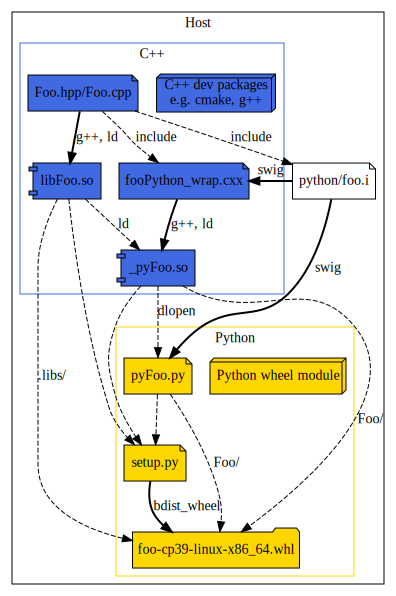
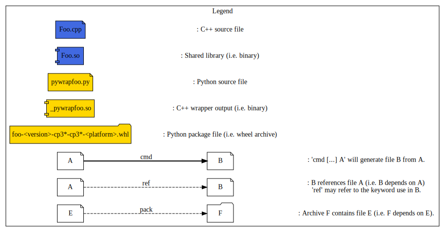

[](https://github.com/Mizux/python-native/actions/workflows/linux.yml)
[](https://github.com/Mizux/python-native/actions/workflows/macos.yml)
[](https://github.com/Mizux/python-native/actions/workflows/win.yml)<br>
[](https://github.com/Mizux/python-native/actions/workflows/docker_amd64.yml)
[](https://github.com/Mizux/python-native/actions/workflows/docker_arm64v8.yml)

# Introduction

This project aim to explain how you build a Python 3 native
(for win-x64, linux-x64 and osx-x64) wheel package using
 [`Python3`](https://www.python.org/doc/) and a [setup.py](https://setuptools.readthedocs.io/en/latest/userguide/quickstart.html).<br>
e.g. You have a cross platform C++ library (using a CMake based build) and a
Python wrapper on it thanks to SWIG.<br>
Then you want to provide a cross-platform Python packages to consume it in a
Python project...

## Table of Content

* [Requirement](#requirement)
* [Directory Layout](#directory-layout)
* [Build Process](#build-process)
* [Appendices](#appendices)
  * [Ressources](#ressources)
* [Misc](#misc)

## Requirement

You'll need "Python >= 3.6".

## Directory Layout

The project layout is as follow:

* [CMakeLists.txt](CMakeLists.txt) Top-level for [CMake](https://cmake.org/cmake/help/latest/) based build.
* [cmake](cmake) Subsidiary CMake files.
  * [python.cmake](cmake/python.cmake) All internall Python CMake stuff.

* [Foo](Foo) Root directory for `Foo` library.
  * [CMakeLists.txt](Foo/CMakeLists.txt) for `Foo`.
  * [include](Foo/include) public folder.
    * [foo](Foo/include/foo)
      * [Foo.hpp](Foo/include/foo/Foo.hpp)
  * [python](Foo/python)
    * [CMakeLists.txt](Foo/python/CMakeLists.txt) for `Foo` Python.
    * [foo.i](Foo/python/foo.i) SWIG .Net wrapper.
  * [src](Foo/src) private folder.
    * [src/Foo.cpp](Foo/src/Foo.cpp)

* [python](python) Root directory for Python template files
  * [`setup.py.in`](python/setup.py.in) setup.py template for the Python native package.

* [ci](ci) Root directory for continuous integration.

## Build Process

Since [Pypi.org](pypi.org) support multi-packages, to Create a native dependent
 package we will simply upload one package per supported platform.

### Native Package

The pipeline should be as follow:<br>



## Appendices

Few links on the subject...

### Ressources

* [Manylinux PEP 600](https://www.python.org/dev/peps/pep-0600/)

## Misc

Image has been generated using [plantuml](http://plantuml.com/):
```bash
plantuml -Tsvg doc/{file}.dot
```
So you can find the dot source files in [doc](doc).

## License

Apache 2. See the LICENSE file for details.

## Disclaimer

This is not an official Google product, it is just code that happens to be
owned by Google.
