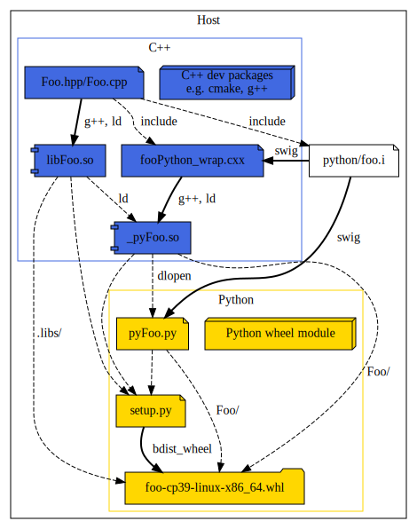
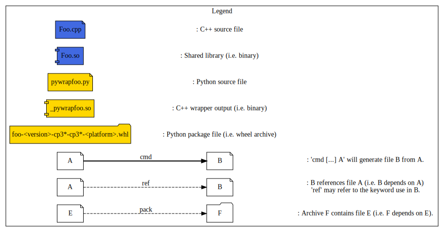

Github-CI:
[![Build Status][github_linux_status]][github_linux_link]
[![Build Status][github_macos_status]][github_macos_link]
[![Build Status][github_windows_status]][github_windows_link]
[![Build Status][github_amd64_docker_status]][github_amd64_docker_link]
[![Build Status][github_aarch64_docker_status]][github_aarch64_docker_link]

[github_linux_status]: https://github.com/Mizux/python-native/actions/workflows/amd64_linux.yml/badge.svg
[github_linux_link]: https://github.com/Mizux/python-native/actions/workflows/amd64_linux.yml
[github_macos_status]: https://github.com/Mizux/python-native/actions/workflows/amd64_macos.yml/badge.svg
[github_macos_link]: https://github.com/Mizux/python-native/actions/workflows/amd64_macos.yml
[github_windows_status]: https://github.com/Mizux/python-native/actions/workflows/amd64_windows.yml/badge.svg
[github_windows_link]: https://github.com/Mizux/python-native/actions/workflows/amd64_windows.yml
[github_amd64_docker_status]: https://github.com/Mizux/python-native/actions/workflows/amd64_docker.yml/badge.svg
[github_amd64_docker_link]: https://github.com/Mizux/python-native/actions/workflows/amd64_docker.yml
[github_aarch64_docker_status]: https://github.com/Mizux/python-native/actions/workflows/aarch64_docker.yml/badge.svg
[github_aarch64_docker_link]: https://github.com/Mizux/python-native/actions/workflows/aarch64_docker.yml

# Introduction
<nav for="project"> |
<a href="#requirement">Requirement</a> |
<a href="#codemap">Codemap</a> |
<a href="#dependencies">Dependencies</a> |
<a href="#build-process">Build</a> |
<a href="ci/README.md">CI</a> |
<a href="#appendices">Appendices</a> |
<a href="#license">License</a> |
</nav>

This is an example of how to create a Modern [CMake](https://cmake.org/) C++/Python Project.

This project aim to explain how you build a Python 3.6+ native wheel package using
 [`Python3`](https://www.python.org/doc/) and a [setup.py](https://setuptools.readthedocs.io/en/latest/userguide/quickstart.html).<br>
e.g. You have a cross platform C++ library (using a CMake based build) and a
Python wrapper on it thanks to SWIG.<br>
Then you want to provide a cross-platform Python packages to consume it in a
Python project...

This project should run on GNU/Linux, MacOS and Windows.

## Requirement

You'll need:

* "CMake >= 3.18".
* "Python >= 3.6" and python module 'pip' (ed "setuptools" and "wheel" will be
 auto installed on demand).

## Codemap

The project layout is as follow:

* [CMakeLists.txt](CMakeLists.txt) Top-level for [CMake](https://cmake.org/cmake/help/latest/) based build.
* [cmake](cmake) Subsidiary CMake files.
  * [python.cmake](cmake/python.cmake) All internall Python CMake stuff.

* [ci](ci) Root directory for continuous integration.

* [Foo](Foo) Root directory for `Foo` library.
  * [CMakeLists.txt](Foo/CMakeLists.txt) for `Foo`.
  * [include](Foo/include) public folder.
    * [foo](Foo/include/foo)
      * [Foo.hpp](Foo/include/foo/Foo.hpp)
  * [src](Foo/src) private folder.
    * [src/Foo.cpp](Foo/src/Foo.cpp)
  * [python](Foo/python)
    * [CMakeLists.txt](Foo/python/CMakeLists.txt) for `Foo` Python.
    * [foo.i](Foo/python/foo.i) SWIG Python wrapper.
* [Bar](Bar) Root directory for `Bar` library.
  * [CMakeLists.txt](Bar/CMakeLists.txt) for `Bar`.
  * [include](Bar/include) public folder.
    * [bar](Bar/include/bar)
      * [Bar.hpp](Bar/include/bar/Bar.hpp)
  * [src](Bar/src) private folder.
    * [src/Bar.cpp](Bar/src/Bar.cpp)
  * [python](Bar/python)
    * [CMakeLists.txt](Bar/python/CMakeLists.txt) for `Bar` Python.
    * [bar.i](Bar/python/bar.i) SWIG Python wrapper.
* [FooBar](FooBar) Root directory for `FooBar` library.
  * [CMakeLists.txt](FooBar/CMakeLists.txt) for `FooBar`.
  * [include](FooBar/include) public folder.
    * [foobar](FooBar/include/foobar)
      * [FooBar.hpp](FooBar/include/foobar/FooBar.hpp)
  * [src](FooBar/src) private folder.
    * [src/FooBar.cpp](FooBar/src/FooBar.cpp)
  * [python](FooBar/python)
    * [CMakeLists.txt](FooBar/python/CMakeLists.txt) for `FooBar` Python.
    * [foobar.i](FooBar/python/foobar.i) SWIG Python wrapper.

* [python](python) Root directory for Python template files
  * [`setup.py.in`](python/setup.py.in) setup.py template for the Python native package.

## Dependencies
To complexify a little, the CMake project is composed of three libraries (Foo, Bar and FooBar)
with the following dependencies:  
```sh
Foo:
Bar:
FooBar: PUBLIC Foo PRIVATE Bar
```

## Build Process

To Create a native dependent package which will contains two parts:

* A bunch of native libraries for the supported platform targeted.
* The Python code depending on it.

note: Since [Pypi.org](pypi.org) support multiple packages, we will simply upload one package per supported platform.

### Local Package
The pipeline for `linux-x86-64` should be as follow:<br>



#### Building local native Package
Thus we have the C++ shared library `libFoo.so` and the SWIG generated
Python wrappers e.g. `pyfoo.py` in the same package.

Here some dev-note concerning this `setup.py`.
* This package is a native package containing native libraries.

Then you can generate the package and install it locally using:
```bash
python3 setup.py bdist_wheel
python3 -m pip install --user --find-links=dist pythonnative
```

If everything good the package (located in `<buildir>/python/dist`) should have
this layout:
```
{...}/dist/pythonnative-X.Y.9999-cp3Z-cp3Z-<platform>.whl:
\- pythonnative
   \- __init__.py
   \- .libs
      \- libFoo.so
      \- ...
   \- foo
      \- __init__.py
      \- pyFoo.py
      \- _pyFoo.so
...
```
note: `<platform>` could be `manylinux2014_x86_64`, `macosx_10_9_x86_64` or `win-amd64`.

tips: since wheel package are just zip archive you can use `unzip -l <package>.whl`
to study their layout.

## Appendices

Few links on the subject...

### Resources
Project layout:
* The Pitchfork Layout Revision 1 (cxx-pflR1)

CMake:
* https://llvm.org/docs/CMakePrimer.html
* https://cliutils.gitlab.io/modern-cmake/
* https://cgold.readthedocs.io/en/latest/

Python:
* [Packaging Python Project](https://packaging.python.org/tutorials/packaging-projects/)
* [PEP 600  Future 'manylinux' Platform Tags](https://www.python.org/dev/peps/pep-0600/)

### Misc
Image has been generated using [plantuml](http://plantuml.com/):
```bash
plantuml -Tsvg docs/{file}.dot
```
So you can find the dot source files in [docs](docs).

## License

Apache 2. See the LICENSE file for details.

## Disclaimer

This is not an official Google product, it is just code that happens to be
owned by Google.
